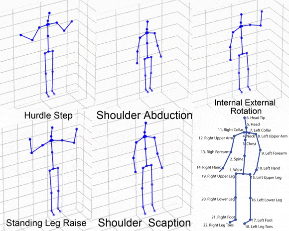

# UI-PRMD-Visualize-python
This is a python port and visualization of the UI-PRMD dataset/paper
This Port Is created for a project i am currently devloping which is in python hence a python port was necessary

UI-PRMD is a data set of movements related to common exercises performed by patients in physical therapy and rehabilitation programs.

[UI-PRMD Website](https://webpages.uidaho.edu/ui-prmd/)

* the paper contains code visualization of the movements written MATLAB which I found cumbersome use 
I adapted the the code and implemented it in python 
* for easy understanding of how the dataset is represented use this port
* use it to convert the 2 file dataset into a single 2D matrix of cartesian cordinates


## Requirements

the following libraries need to be installed 
* python 3.6
* numpy
* matplotlib
* pandas
* celluloid 

copy the following while creating the virtual env
```bash
pip install matplotlib
pip install pandas
pip install numpy
pip install celluloid
```

## examples


(rendered in matplotlib)


### data set and code explanation TLDR style ;)  ###
within the segmented movements(download from website link) folder are many movements their positions and corresponding angles
m01_s01_e02_angles.txt

corresponds to movement 1 subject 1 episode 2's angle inforamtion
if read as an array
it would be something like
|       |joint1 X angle  | joint1 Y angle |joint1 Z angle | joint2 X angle|.|.|
|----   |-------------   | -------------  |------------   |---|--|--|
|frame1 |*data*          | *data*         |    *data*     |*data*| *data*|*data*|
|frame2 |*data*          | *data*         |    *data*     |*data*| *data*|*data*|
|.      | *data*         | *data*         |    *data*     |*data*| *data*|*data*|
|.      |*data*          | *data*         |    *data*     |*data*| *data*|*data*|
|.      |*data*          | *data*         |    *data*     |*data*| *data*|*data*|

[frames x 66] (22 joints x 3 axis = 66)

similarly it is same for the positions file

as the angles are YXZ triplet of Euler angles we combine it with the positions and 
after all operations the resulting and returned numpy array shape is [22 X 3 X frames]
this is plotted as a skeleton in matplotlib

the 3 columns represent the x,y,z values x-left, right y-up,down, z- in and out of screen

each row is a joint

depth is the frames the kinect used to capture data is 30FPS

* joint list  

Waist,Spine,Chest,Neck,Head,Head tip,Left Collar,Left Upper arm,Left for arm,Left hand,Right collar,Right upper arm,Right forearm,Right hand,Left upper leg,Left lower leg,Left foot,Left leg toes Right upper leg,Right lower leg,Right foot

*movemet list

(a) Deep squat (m01); (b) Hurdle step (m02); (c) Inline
lunge (m03); (d) Side lunge (m04); (e) Sit to stand (m05); (f) Standing active straight leg raise (m06);
(g) Standing shoulder abduction (m07); (h) Standing shoulder extension (m08); (i) Standing shoulder
internal-external rotation (m09); (j) Standing shoulder scaption (m10)

#### hope this port is useful to understand the dataset ####
#### disclaimer i am not the creator or owner of this dataset i have merely visualized the data ####
#### [get the data set and read more here on the official UI-PRMD dataset](https://webpages.uidaho.edu/ui-prmd/)
